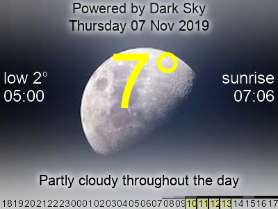

# weatherWHAT

Weather forecast display for the Pimeroni Inky wHAT, with weather data powered by Darksky. If you don't have an Inky wHAT, you can display the weather on your desktop background or screensaver, or just as text in your terminal.



## Get Started

Download the git repo:
```
sudo apt install git
git clone https://github.com/seaniedan/weatherWHAT.git
```

Install the below prerequisites. You can also [install the prerequisites using Anaconda.](./docs/anacondaInstall.md)

### Prerequisites

If you don't have pip3 (for example if using raspbian-lite), you'll first need to install it:
```
sudo apt-get update
sudo apt install python3-pip
```
The [Python API wrapper for DarkSky by Detrous](https://github.com/Detrous/darksky) is used to parse the weather information:
```
pip3 install darksky_weather
```

[Pillow, a fork of the Python Imaging Library (PIL)](https://pillow.readthedocs.io/en/stable/) is used to draw data on the images:
```
pip3 install Pillow
```

To display the weather forecast on your Pimeroni Inky wHAT, attach the display to your Raspberry Pi or compatible device and install the drivers (this may take a while): 
```
sudo pip3 install inky
```
To discover weather around the world using natural text ('Paris, France'), install [geopy](https://geopy.readthedocs.io/en/stable/)
```
pip3 install geopy
```
If you want to display the images on your computer, using the -d option, Pillow requires a viewer. Install [Imagemagick](https://imagemagick.org/script/download.php): 
```
sudo apt-get install imagemagick
```
### Install

[Register with Darksky](https://darksky.net/dev/register), enter your email adress and create a password. The Darksky API allows 1000 free calls per day and you don't need to give any payment information. 

Darksky will send you an email with an API code. Enter this code in api.txt by replacing the path below and using the API code they sent instead of the dummy code below (keep the quotes):
```
cd /path/to/weatherhWHAT/
echo '1234567890abcde' > api.txt
```

If you have installed GeoPy, to see the weather in Paris:
```
weatherWHAT.py -l 'paris, france' 
```
To display a map, use -m or -z (for the zoomed map):
```weatherWHAT.py -dz -l melbourne```

## Deploy

You can install on a [Raspberry Pi](https://www.raspberrypi.org/) connected to a [Inky wHAT](https://shop.pimoroni.com/products/inky-what). 
If you don't have a suitable display, you can set this script up to, for example, change your desktop backdrop, or use the output images in your screensaver. 

Use the -s option and specify a file to save to (.jpg or .png). 

e.g. On Ubuntu Mate, to update your desktop background, you can use:
```
crontab examples/mate_desktop_cron.txt
```
to save the image in your desktop background location.

## Contribute

Please send a message or pull request if you spot something that isn't clear or doesn't work. Want to help? 
* Write an installation script
* Share your icon packages - see 'how to create an icon package' below


## Author

* **[Sean Danischevsky](https://danischevsky.com)**


## License

This project is licensed under the GNU General Public License v3.0 - see the [LICENSE.md](LICENSE.md) file for details

## Acknowledgments

* [Pimeroni](https://shop.pimoroni.com/) for their inspiring products
* [Darksky](https://darksky.net) for hyperlocal weather data
* Olivia and Benet for cool drawings of various types of weather
